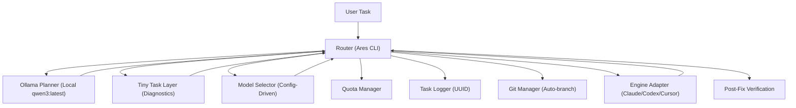

# 🧠 Ares 2.0: Agent Orchestrator

A production-grade, deterministic multi-agent orchestrator CLI. Ares routes tasks to the best localized executor (Claude, Codex, or Cursor) based on a strategic planning phase powered by local Ollama.

## 🏗️ Architecture



- **Planning Layer**: Uses local Ollama model to classify tasks, assign risk/confidence scores, and decompose tasks into discrete slices.
- **Tiny Task Layer (Diagnostics)**: Offloads raw terminal output parsing and diff summarization to local Ollama, reducing token load on Claude by 60-80%.
- **Routing Layer**: Deterministic rules in `config/ares/models.yml` allocate tasks to engines based on type and risk.
- **Automated Fix Loop**: Detects failures, summarizes them locally, escalates for a fix, and re-verifies automatically.
- **Traceability**: Every task receives a UUID and is logged in `logs/UUID.json`.
- **Safety**: Built-in quota tracking and confidence-based escalation to Claude Opus for high-risk work.

## 📟 Terminal User Interface (TUI)

Ares 2.0 includes a professional, interactive dashboard for real-time task management.
```bash
bin/ares --tui
```
- **Live Monitoring**: Track quotas, task history, and AI reasoning live.
- **In-App Config**: Change models and Ollama settings without leaving the CLI.
- **Universal Fixes**: Trigger test, lint, or syntax healing with one keypress.

## 📚 Documentation & Guides

- [**TUI Guide**](file:///home/nemesis/project/agent-orchestrator/docs/TUI_GUIDE.md): Master the interactive dashboard.
- [**Self-Healing Guide**](file:///home/nemesis/project/agent-orchestrator/docs/SELF_HEALING.md): How Ares automatically repairs your code.
- [**Configuration Guide**](file:///home/nemesis/project/agent-orchestrator/docs/CONFIGURATION.md): Tuning model routing and local AI parameters.

## 🚀 Usage

Install dependencies:
```bash
bundle install
```

Run a task:
```bash
exe/ares "Task description"
```

### Automated Diagnostic Loop
To run tests and automatically attempt fixes for failures:
```bash
exe/ares "run tests"
```

### Flags
- `-d, --dry-run`: Plan and select model without execution.
- `-g, --git`: Auto-branch before execution and auto-commit results.

## 🎯 Model Routing Rules

Routed via `config/models.yml`:
- **Architecture**: Claude Opus (High Reasoning)
- **Refactor**: Claude Sonnet (Primary Executor)
- **Bulk Patch / Test Gen**: Codex (High Speed)
- **Interactive Edit**: Cursor Agent (Human-in-the-loop)
- **Summarization**: Claude Haiku (Low Cost)

## 🔐 Safety & Project Hygiene

1. **Deterministic One-Hop**: No recursive agent loops.
2. **Quota Aware**: Claude usage is tracked daily via `QuotaManager`.
3. **Workspace Isolation**: Execution is pinned to the current directory's context via recursive `AGENTS.md` discovery.
4. **Git Protection**: `.gitignore` automatically excludes `logs/`, `*.gem`, and AI-specific session/cache directories (`.claude`, `.cursor`, etc.).

## 🛠️ Configuration

- `config/models.yml`: Define routing logic and confidence thresholds.
- `config/workspaces.yml`: Register explicit workspace roots.
- `config/planner_schema.rb`: The strict JSON schema for the Ollama planner.

## 🛤️ Roadmap

- [ ] **Cost Tracker**: USD/token cost calculation per engine.
- [ ] **Parallel Execution**: Execute independent task slices concurrently.
- [ ] **Automatic Diff Chunking**: Handle massive diffs by chunking before LLM processing.
- [ ] **Rate Limiting**: Intelligent throttling to prevent mid-workflow blocks.

---
**Author**: Antigravity (shubhamtaywade82@gmail.com)
**Repository**: [github.com/shubhamtaywade82/agent-orchestrator](https://github.com/shubhamtaywade82/agent-orchestrator)
